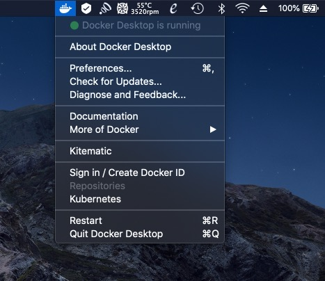
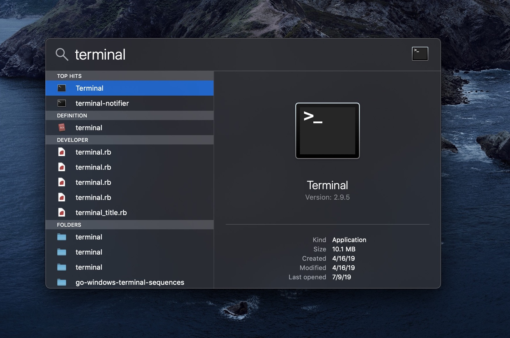
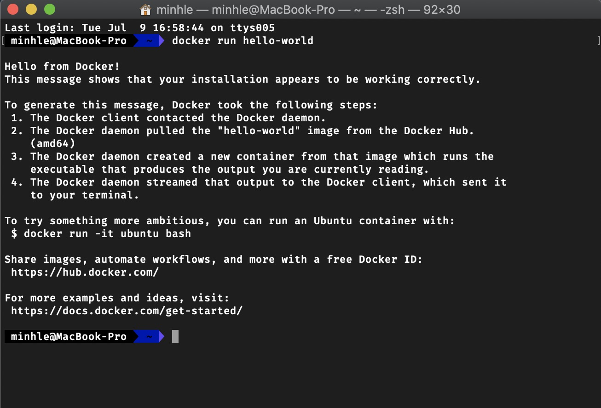
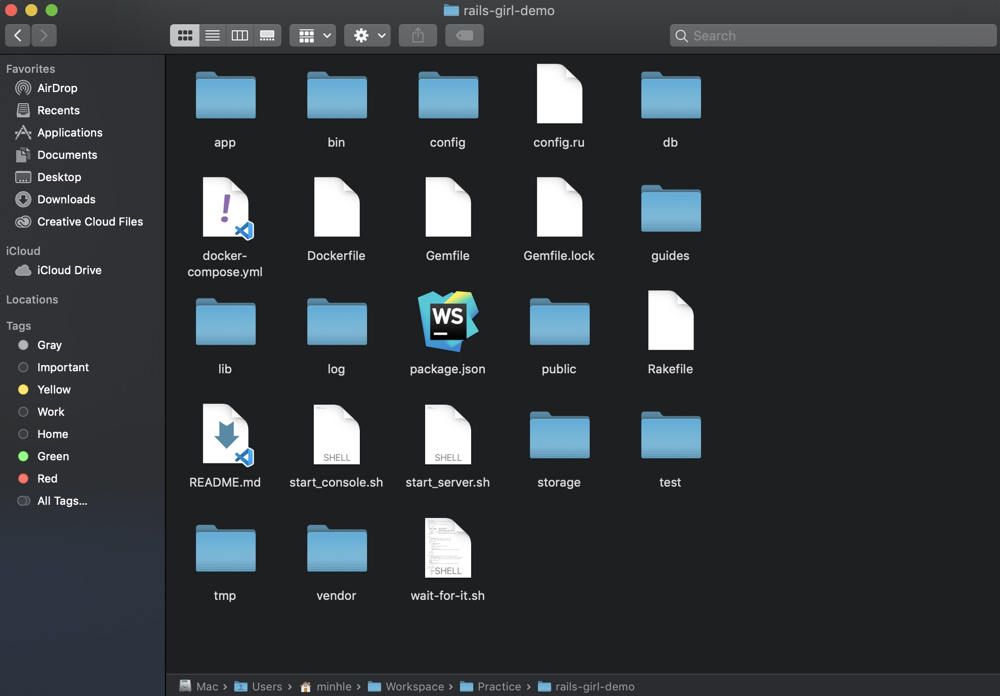
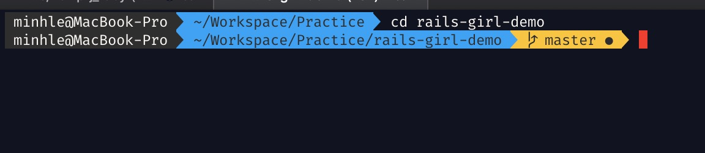
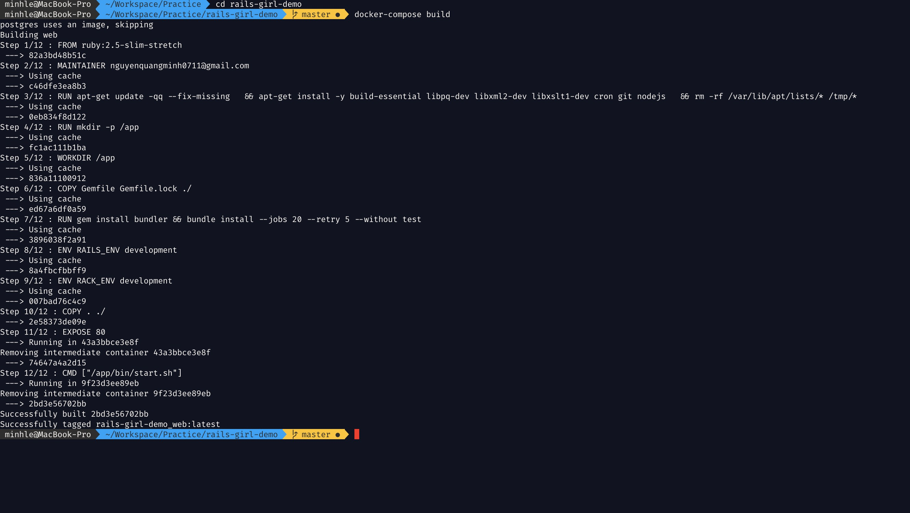

# Docker For MacOS
## Installation
Follow instructions from [Docker main page][1]

**NOTE**: Docker for MacOS requires:
- Mac hardware must be a 2010 or newer model, with Intel’s hardware support for memory management unit (MMU) virtualization, including Extended Page Tables (EPT) and Unrestricted Mode. You can check to see if your machine has this support by running the following command in a terminal: sysctl kern.hv_support

- MacOS Sierra 10.12 and newer macOS releases are supported. We recommend upgrading to the latest version of macOS.

- At least 4GB of RAM

- VirtualBox prior to version 4.3.30 must NOT be installed (it is incompatible with Docker Desktop for Mac). If you have a newer version of VirtualBox installed, it’s fine.

## Post Installation
### Verify Docker is running
See the Docker icon in the notification area



### Interact with Docker through Terminal
Open MacOS Terminal Press Command + Space (⌘ + ⎵) and type "terminal" to find it.
Then type following command to verify Docker installation


```
docker run hello-world
```




### Download Rails demo project from Github
Open [workshop environment setup from Github][2]


### Extract download zip package to some folder



### Use Terminal to open demo folder



### And We are ready for workshop!

From here we are ready to follow [workshop guide][2]




[1]: https://docs.docker.com/docker-for-mac/install/
[2]: https://github.com/nguyenquangminh0711/rails-girl-demo
